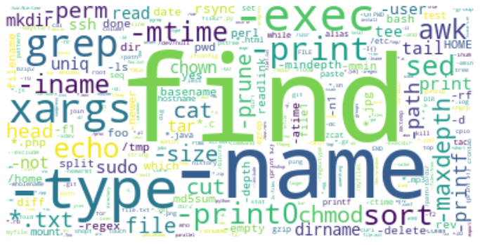

Pre-processing depends on `bashlex` (https://github.com/idank/bashlex) library.  
  
Dataset (i.e. `all.cm`) is based on `nl2bash` paper (https://arxiv.org/abs/1802.08979; https://github.com/TellinaTool/nl2bash).  

Example usage:
```
from bashprocessing import Parser

with open("all.cm") as file:
    data = file.readlines()

p = Parser()
data_counter = p.parse(data)

print(data_counter.most_common(5))

    [('find', 7846),
    ('|', 6487),
    ('.', 3775),
    ('-name', 3616),
    ('-type', 3403)]
```




Next steps:
1. Implement POS tagger
2. Encoding: TF-IDF, LabelEncoder, OneHotEncoder
