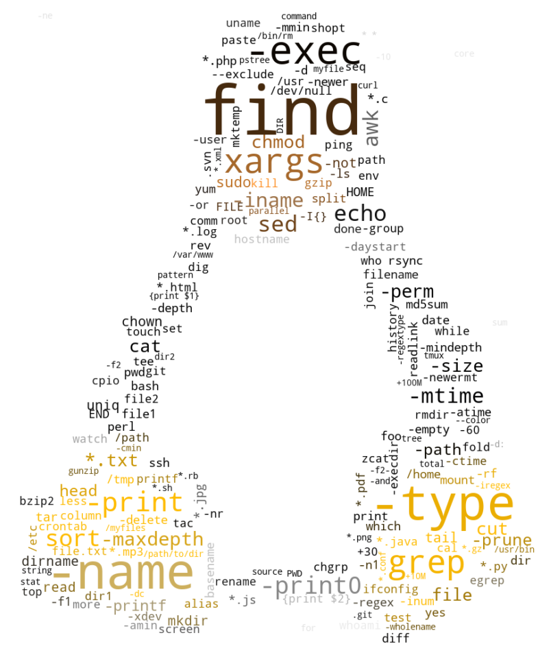
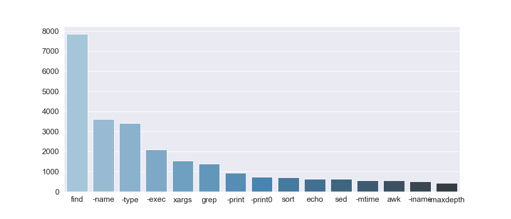

<p align="center">

## Example usage
```
from bashprocessing import Parser

with open("all.cm") as file:
    data = file.readlines()

p = Parser()
data_counter, data_corpus = p.parse(data)
print(data_counter.most_common(5))

[Out]:
    [('find', 7846),
    ('|', 6487),
    ('.', 3775),
    ('-name', 3616),
    ('-type', 3403)]

encoded_X = p.encode(mode="onehot")
print(encoded_X[0])

[Out]:
    array([1, 1, 0, 0, 0, 0, 1, 0, 0, 1, 0, 0, 0, 0, 0, 0, 0, 0, 0, 0, 0, 0,
       0, 0, 0, 0, 0, 0, 0, 0, 0, 0, 0, 0, 1, 0, 0, 0, 0, 0, 0, 0, 0, 0,
       0, 0, 0, 0, 0, 0, 0, 0, 0, 0, 0, 0, 0, 0, 0, 0, 0, 0, 0, 0, 0, 0,
       0, 0, 0, 0, 0, 0, 0, 0, 0, 0, 0, 0, 0, 0, 0, 0, 0, 0, 0, 0, 0, 0,
       0, 0, 0, 0, 0, 0, 0, 0, 0, 0, 0, 0])
```

At this point data is ready to be supplied as input for your ML model:
```
mymodel.fit(encoded_X,y)
```

## Notes

- Pre-processing depends on `bashlex` (https://github.com/idank/bashlex) library.  
- Benign example dataset (i.e. `data/nl2bash.cm`) is based on `nl2bash` paper (https://arxiv.org/abs/1802.08979; https://github.com/TellinaTool/nl2bash).
- Malicious example dataset is collected from various Penetration Testing resources and scripts, some examples:
    - [Reverse Shell Cheat Sheet](https://github.com/swisskyrepo/PayloadsAllTheThings/blob/master/Methodology%20and%20Resources/Reverse%20Shell%20Cheatsheet.md)
    - [LinEnum.sh Script](https://github.com/rebootuser/LinEnum/blob/master/LinEnum.sh)
    - [Linux Privilege Escalation Guide](https://blog.g0tmi1k.com/2011/08/basic-linux-privilege-escalation/)

> Note that datasets are normalized so remote host is specified as `example.com`in both command sets.

- Some ideas of exploratory data analysis and visualiations can be found under `/eda/`:



## Potential improvements

1. Encoding: TF-IDF
2. POS tagger
